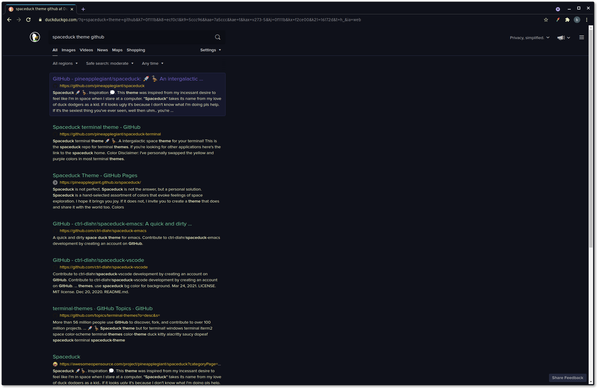

# Spaceduck for [DuckDuckGo](https://duckduckgo.com/)

> A [spaceduck](https://github.com/pineapplegiant/spaceduck) theme for [DuckDuckGo](https://duckduckgo.com/)

---

### Additional previews

With hovering:

With text-box on search results:

With hovering and text-box on search results:

## Install

Do _**one**_ of the following:

1.  Navigate to https://duckduckgo.com/settings#appearance and manually update the fields to match the following:

    

2. (Less permanently) Try it out by visiting [the following: DuckDuckGo - Spaceduck theme settings](https://duckduckgo.com/?kae=t&kbc=1&kax=v273-5&k8=ecf0c1&k21=16172d&k7=0f111b&k9=5ccc96&kaa=7a5ccc&kx=f2ce00&kj=0f111b)
    * Note: This will not be persisted, and if you wish to have it so, you must do additional steps to either save this as your settings, or start as your home page/etc.

## License

[MIT License](./LICENSE)

